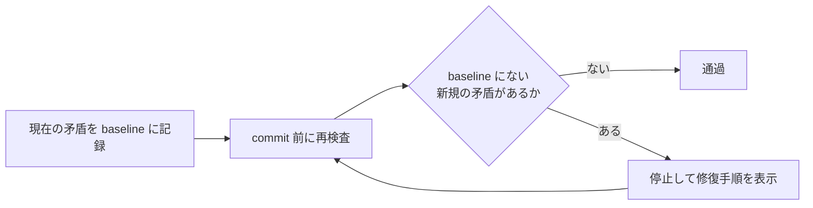

# ai-ratchet-gate

git の「**tracked なのに gitignore にマッチする**」矛盾の増分を、commit 時に fail-closed で止める
ratchet 型ゲートです。AI エージェントが並走する repo を主な対象にしています。

## 目的

追跡済みファイルとignoreルールの食い違いを早期に見つけ、同じ障害が増え続けることを防ぎます。
既存の矛盾を一度に全修復させず、今日より悪化させない運用を小さく導入できます。

## できること

- `tracked ∧ ignored` の現在値をbaselineとして記録する
- baselineにない新規の矛盾を検出してcommit前に停止する
- 解消済みの項目を示し、baselineを縮める方向の改善を妨げない
- 日本語を含むパスを安全に扱い、検査不能時はfail-closedで停止する

## なぜ要るか

gitignore は**追跡済みファイルには効きません**。「先に commit されたファイルへ、後から ignore
ルールが足される」と、ignore は空振りしたまま矛盾状態が固定されます。生成物がこの状態になると、
ツールが走るたび dirty が復活し、push や自動化を静かに阻害し続けます。

実際に起きた事故 (本ゲートの起源): 診断ツールの出力 2 ファイルがこの状態になり、7 つの作業
セッションで push 阻害が再発。原因を言語化してから同類を機械列挙したところ、workspace 全体で
**779 件**の同じ矛盾が見つかりました。この状態は git の標準機能だけで列挙できます。

AI エージェント運用では、この事故は人間だけの時より起きやすくなります。エージェントは
「push が通らないから commit で押し流す」という対症療法を高速に反復できてしまうためです。

## 仕組み (ratchet = 爪付きで逆回転しない歯車機構)

- 既存の矛盾は baseline に記名して grandfather する (導入日に全部直せとは言わない)
- **baseline に無い新規の矛盾だけ deny** する (増える方向にはロックが掛かる)
- baseline の増減は `--update-baseline` 経由でファイル diff になり、レビューで必ず見える
- 列挙に失敗した場合は成功を報告しない (fail-closed)

矛盾が新しく生まれる経路は 2 つで、両方止まります:

1. `git add -f` で ignored ファイルを強制追加した
2. 既に tracked のファイルへ後から ignore ルールを追記した

## 使い方

### AIを使う人

このリポジトリのGitHub URLを、普段使っているAIのチャットへコピー＆ペーストし、
「このラチェットゲートを私のリポジトリへ導入して」と依頼してください。
AIには、導入先の現状確認、baselineの作成、commit前の検査への接続、テストまで任せられます。
生成された変更は、そのまま採用せず、必ず差分を人間がレビューしてください。

### 手動で導入する人

必要なのはPython 3.11以降とgitだけです。Pythonパッケージとしてインストールする方法と、
ソースcheckoutから直接実行する方法があります。初回に現在の矛盾をbaselineとして記録し、
以後のcommit前に検査を実行するよう接続してください。具体的なオプションはコマンドの
ヘルプで確認できます。

deny 時のエラー文には修復手順が同梱されます:
生成物なら `git rm --cached <file>` / 実装なら `.gitignore` に `!<path>` /
意図的な例外なら `--update-baseline` (diff がレビュー対象になる)。
緊急回避は `AI_RATCHET_GATE_SKIP=1` (痕跡が出力に残ります)。

## 設計原則

- **tracked ∧ ignored**: Git で追跡済みでありながら、`.gitignore` の対象にもなっているファイルを検出する
- **fail-closed**: 列挙に失敗した状態で OK を返さない。baseline が無ければ初期化を要求して止まる
- **増分のみ**: 既存負債で今日の commit を止めない。締まる方向 (baseline が縮む) には自由
- **可視な例外**: baseline は commit されるファイルなので、こっそり緩めることができない
- **非 ASCII 安全**: `-z` 区切りで列挙し、日本語パスでも octal escape に化けない

## 限界 (正直に)

- 検出するのは「tracked ∧ ignored」という**1 つの不変条件だけ**。既存の矛盾は baseline として扱い、
  新たな増加をラチェット方式で阻止する。品質全般のゲートではない
- baseline はパス集合なので net-zero swap (1 件消して別の 1 件を足す) は**検出できる**が、
  同一パスが baseline に出入りを繰り返す「往復発散」は検出しない
- hook を素通りする経路 (`--no-verify`、hook 未導入環境からの commit) は止められない。
  関所の網羅は運用側の責務

## 先行事例

- [qntm — Ratchets in software development](https://qntm.org/ratchet) (2021、命名の起点)
- [Notion — eslint-seatbelt](https://github.com/justjake/eslint-seatbelt) (file×rule 単位の ESLint ratchet)
- [ESLint bulk suppressions](https://eslint.org/blog/2025/04/introducing-bulk-suppressions/) (2025、本体コア機能化)
- [SonarQube — Clean as You Code](https://docs.sonarsource.com/sonarqube-server/10.6/user-guide/clean-as-you-code)
- [imbue-ai/ratchets](https://github.com/imbue-ai/ratchets) (lint 予算型、agent-friendly を明示)
- [iangrunert/git-ratchet](https://github.com/iangrunert/git-ratchet) (汎用計測値の ratchet)

これらは lint 違反数や計測値を対象にしています。本ゲートは **git の状態矛盾そのもの**を
不変条件として扱う点が異なります。

## テスト

検証は `scripts/verify.py` へ統一しています。選択したPythonにtest依存がない場合は、別環境へ暗黙に
フォールバックせず、同じPythonへインストールするためのコマンドを表示して停止します。

## Repo Preflight

pushやPull Requestの前には、共通ツール
[`repo-preflight`](https://github.com/nexus-ai-2045/repo-preflight)で、secret候補、個人path、
必須文書、実装・テスト・説明の整合性を検査します。

`.repo-preflight-consistency.json`には、このリポジトリ固有の変更連鎖だけを宣言します。
検査ロジックはコピーせず、`repo-preflight`を正本として使います。導入直後は`shadow`で
誤検知を観測し、人間レビュー後に`ratchet`、さらに所見ゼロを確認してから`enforce`へ
段階的に移行します。

Repo Preflightの成功は、push、merge、公開の承認ではありません。

## Repository visibility

このrepositoryは現在PRIVATEです。ソフトウェアにはMIT Licenseを採用していますが、
public化、tag、GitHub Release作成はそれぞれ別の承認境界です。PyPIへは送信しません。
