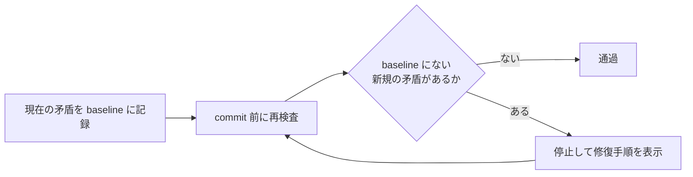

# ai-ratchet-gate

人間が確認した失敗を、agent非依存の実行可能なguardへ変換し、同じ種類の新規悪化を
fail-closedで止めるratchet型ゲートです。Gitの「trackedなのにignored」は最初の組み込みadapterです。

## ratchetは本質的に何を解決するか

解決する問題は 1 つだけです: **「悪い状態の集合が増えても、誰も気づかないまま作業が続く」**。

- 全部直せとは言わない (既存分はbaselineに記名して見逃す)
- その代わり、**悪化方向へ 1 件でも増えたら止める** (悪化の単調性を断つ)
- 改善方向 (集合が縮む) は常に自由

AIエージェント運用でこれが効くのは、エージェントが「直す」より速い対症療法
(skipする・force addする・押し流す) を高速反復できてしまうためです。ratchetは
個々の対症療法を禁止する代わりに、**その結果としての悪化だけを機械で検出**します。

## 何が汎用で、何が個別か

| 層 | 中身 | 汎用性 |
|---|---|---|
| core (`engine` / `model` / `receipt`) | 安定Finding IDの集合比較・mode判定・digest付きreceipt | 対象を問わない (gitを知らない) |
| adapter | 対象を観測しFinding IDへ正規化する | 対象ごとに個別。現在は `git.tracked_ignored` の 1 個だけ |
| baseline / waiver | レビュー済みの見逃しリスト | 形式は汎用、中身は対象ごと |

つまり「git事故ツール」は入口の見た目で、実体は**任意の決定論的検査をratchet化する枠**です。
第二adapter候補は [ROADMAP](ROADMAP.md) Phase 2 と
[Issue #11](https://github.com/nexus-ai-2045/ai-ratchet-gate/issues/11) (テスト無効化の増分検知) を参照。

## 今なにがratchetとして機能しているか

| 対象 | 状態 |
|---|---|
| このrepoの `tracked ∧ ignored` | **稼働中** (CI verify + baseline 0 件) |
| 汎用 `observe` / `evaluate` subcommand | 提供中 (opt-in。adapterは上記 1 個) |
| memory / skills / tool権限 / eval | **未実装** (構想。ROADMAP Phase 2 以降) |

## 現在の実装と構想

本ツールはMemory、Skill、エージェントの自己改善機能ではありません。汎用coreは、adapterが
返した安定Finding IDをレビュー済みbaselineと比較し、`accepted / new / resolved`を機械判定して
入力digest付きreceiptを返します。Gitの`tracked ∧ ignored`検査は既存CLI互換を維持しています。

同じ「既存負債は直ちに全修復させず、新しい悪化だけを止める」契約を、将来memory、skills、
tool権限、agent設定、evalなどへ適用できます。Hermes Agentなどが
知識や手順を学習・再利用する層だとすれば、本ツールはその変化が安全基準を後退させていないかを
外側から決定論的に検査する補完層です。

実装済み・未実装の境界と段階的な完了条件は[ROADMAP.md](ROADMAP.md)に記載しています。

## 目的

追跡済みファイルとignoreルールの食い違いを早期に見つけ、同じ障害が増え続けることを防ぎます。
既存の矛盾を一度に全修復させず、今日より悪化させない運用を小さく導入できます。

## できること

- `tracked ∧ ignored` の現在値をbaselineとして記録する
- baselineにない新規の矛盾を検出してcommit前に停止する
- 解消済みの項目を示し、baselineを縮める方向の改善を妨げない
- 日本語を含むパスを安全に扱い、検査不能時はfail-closedで停止する
- solution-knowledgeのload / compose / resolveで、検証済み解法を決定論的に選択して返す
  （対象repoは変更しない。契約は[ADR-0002](docs/adr/ADR-0002-review-knowledge-propagation.md) /
  [ADR-0003](docs/adr/ADR-0003-solution-knowledge-propagation.md)）

## なぜ要るか

gitignore は**追跡済みファイルには効きません**。「先に commit されたファイルへ、後から ignore
ルールが足される」と、ignore は空振りしたまま矛盾状態が固定されます。生成物がこの状態になると、
ツールが走るたび dirty が復活し、push や自動化を静かに阻害し続けます。

実際に起きた事故 (本ゲートの起源): 診断ツールの出力 2 ファイルがこの状態になり、7 つの作業
セッションで push 阻害が再発。原因を言語化してから同類を機械列挙したところ、workspace 全体で
**779 件**の同じ矛盾が見つかりました。この状態は git の標準機能だけで列挙できます。

AI エージェント運用では、この事故は人間だけの時より起きやすくなります。エージェントは
「push が通らないから commit で押し流す」という対症療法を高速に反復できてしまうためです。

## 仕組み (ratchet = 爪付きで逆回転しない歯車機構)

- 既存の矛盾は baseline に記名して grandfather する (導入日に全部直せとは言わない)
- **baseline に無い新規の矛盾だけ deny** する (増える方向にはロックが掛かる)
- baseline の増減は `--update-baseline` 経由でファイル diff になり、レビューで必ず見える
- 列挙に失敗した場合は成功を報告しない (fail-closed)



矛盾が新しく生まれる経路は 2 つで、両方止まります:

1. `git add -f` で ignored ファイルを強制追加した
2. 既に tracked のファイルへ後から ignore ルールを追記した

## 使い方

### 汎用engine（opt-in）

`observe`が組み込みadapterで対象をread-only観測して`ai-ratchet-gate.observation/v1`のJSONを
生成し、`evaluate`がそれをレビュー済みの`ai-ratchet-gate.baseline/v1`と比較します。

```console
ai-ratchet-gate observe \
  --repo . \
  --subject repo:owner/name@COMMIT_SHA \
  --out observation.json

ai-ratchet-gate evaluate \
  --observation observation.json \
  --baseline baseline.json \
  --expected-subject repo:owner/name@COMMIT_SHA \
  --receipt receipt.json
```

exit codeはallow=`0`、deny=`1`、schema不明や観測不能=`2`です。`--subject`と
`--expected-subject`はenforcement側（hook / CI）が固定し、利用者入力から組み立てないでください。
`evaluate --mode observe`は新規findingがあってもexit 0を返す観測専用modeなので、
enforcement側では`--mode`を渡さない（既定`ratchet`）か`strict`に固定してください。
baselineの拡大、waiver、ruleのenforce昇格は自動承認しません。契約詳細は
[ADR-0001](docs/adr/ADR-0001-generic-ratchet-engine.md)を参照してください。

### AIを使う人

このリポジトリのGitHub URLを、普段使っているAIのチャットへコピー＆ペーストし、
「このラチェットゲートを私のリポジトリへ導入して」と依頼してください。
AIには、導入先の現状確認、baselineの作成、commit前の検査への接続、テストまで任せられます。
生成された変更は、そのまま採用せず、必ず差分を人間がレビューしてください。

### 手動で導入する人

必要なのはPython 3.11以降とgitだけです。Pythonパッケージとしてインストールする方法と、
ソースcheckoutから直接実行する方法があります。初回に現在の矛盾をbaselineとして記録し、
以後のcommit前に検査を実行するよう接続してください。具体的なオプションはコマンドの
ヘルプで確認できます。

GitHub Release版は、release assetを直接指定してインストールします。現在公開済みのv0.1.1は
`python -m pip install https://github.com/nexus-ai-2045/ai-ratchet-gate/releases/download/v0.1.1/ai_ratchet_gate-0.1.1-py3-none-any.whl`
です。PyPIには公開しないため、`pip install ai-ratchet-gate`は実行しないでください。同名を
第三者が取得した場合、無関係なパッケージをインストールする危険があります。

配布物のSHA-256はRelease preflightのCI logとGitHub Releaseの本文に記録します。CIや共有環境では
URL直指定ではなく、次のようにhashを固定したrequirementsで検証付きインストールしてください。

```text
ai-ratchet-gate @ https://github.com/nexus-ai-2045/ai-ratchet-gate/releases/download/v0.1.1/ai_ratchet_gate-0.1.1-py3-none-any.whl \
  --hash=sha256:<Release本文に記載のSHA-256>
```

`python -m pip install --require-hashes -r requirements.txt`で、hash不一致時は停止します。

deny 時のエラー文には修復手順が同梱されます:
生成物なら `git rm --cached <file>` / 実装なら `.gitignore` に `!<path>` /
意図的な例外なら `--update-baseline` (diff がレビュー対象になる)。
緊急回避は `AI_RATCHET_GATE_SKIP=1` (痕跡が出力に残ります)。

## 設計原則

- **tracked ∧ ignored**: Git で追跡済みでありながら、`.gitignore` の対象にもなっているファイルを検出する
- **fail-closed**: 列挙に失敗した状態で OK を返さない。baseline が無ければ初期化を要求して止まる
- **増分のみ**: 既存負債で今日の commit を止めない。締まる方向 (baseline が縮む) には自由
- **可視な例外**: baseline は commit されるファイルなので、こっそり緩めることができない
- **非 ASCII 安全**: `-z` 区切りで列挙し、日本語パスでも octal escape に化けない

## 限界 (正直に)

- 組み込み観測は現在「tracked ∧ ignored」という**1つの不変条件だけ**。汎用coreが別領域を
  自動理解するわけではなく、対象ごとに決定論的adapterと人間確認済みfixtureが必要
- baseline はパス集合なので net-zero swap (1 件消して別の 1 件を足す) は**検出できる**が、
  同一パスが baseline に出入りを繰り返す「往復発散」は検出しない
- hook を素通りする経路 (`--no-verify`、hook 未導入環境からの commit) は止められない。
  関所の網羅は運用側の責務

## 先行事例

- [qntm — Ratchets in software development](https://qntm.org/ratchet) (2021、命名の起点)
- [Notion — eslint-seatbelt](https://github.com/justjake/eslint-seatbelt) (file×rule 単位の ESLint ratchet)
- [ESLint bulk suppressions](https://eslint.org/blog/2025/04/introducing-bulk-suppressions/) (2025、本体コア機能化)
- [SonarQube — Clean as You Code](https://docs.sonarsource.com/sonarqube-server/10.6/user-guide/clean-as-you-code)
- [imbue-ai/ratchets](https://github.com/imbue-ai/ratchets) (lint 予算型、agent-friendly を明示)
- [iangrunert/git-ratchet](https://github.com/iangrunert/git-ratchet) (汎用計測値の ratchet)

これらは lint 違反数や計測値を対象にしています。本ゲートは **git の状態矛盾そのもの**を
不変条件として扱う点が異なります。

## テスト

検証は `scripts/verify.py` へ統一しています。選択したPythonにtest依存がない場合は、別環境へ暗黙に
フォールバックせず、同じPythonへインストールするためのコマンドを表示して停止します。

## Repo Preflight

pushやPull Requestの前には、共通ツール
[`repo-preflight`](https://github.com/nexus-ai-2045/repo-preflight)で、secret候補、個人path、
必須文書、実装・テスト・説明の整合性を検査します。

`.repo-preflight-consistency.json`には、このリポジトリ固有の変更連鎖だけを宣言します。
検査ロジックはコピーせず、`repo-preflight`を正本として使います。導入直後は`shadow`で
誤検知を観測し、人間レビュー後に`ratchet`、さらに所見ゼロを確認してから`enforce`へ
段階的に移行します。

Repo Preflightの成功は、push、merge、公開の承認ではありません。

## Repository visibility

このrepositoryはPUBLICです。ソフトウェアにはMIT Licenseを採用し、配布物は
[GitHub Release](https://github.com/nexus-ai-2045/ai-ratchet-gate/releases)で公開します。
PyPIへは送信しません。tag、GitHub Release作成、将来の公開物はそれぞれ人間レビューを経ます。
